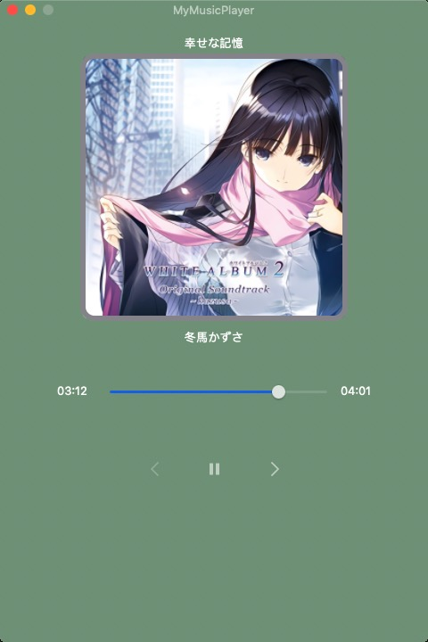

# MyMusicPlayer
A simple macOS Music Player written Programmatically(**No StoryBoard**) in Swift with a very basic **MVVM** Structure(Not Strict MVVM) .

# Develop Environment

macOS 10.14 + Swift 4.2

# Features

* darkAqua UI with macOS 10.14 and vibrantDark UI with macOS 10.13
* Window reopen after clicking dock icon
* Drag and Drop music files to play
* Last and Next music button enable state logic control according to the number of dropped music files and index of playing music in those files.
* Play and Pause button control
* ProcessSlider control

# TODO

* File Open to play menu

* Save and Load PlayList
* PlayList UI with a table includes title and artist at right side
* Auto play mode and Loop mode
* ......
